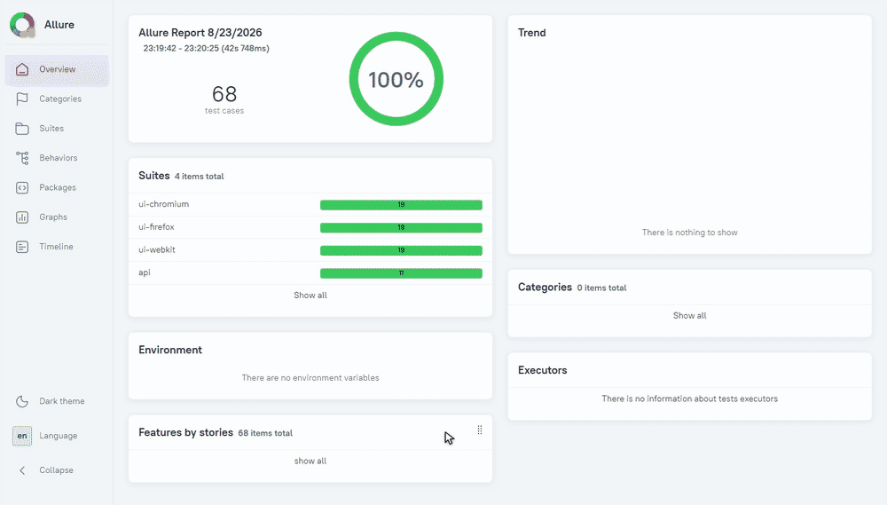

# Playwright E2E Showcase

[](https://github.com/Davidsedaliana/playwright-e2e-showcase/actions/workflows/e2e.yml)
[](https://davidsedaliana.github.io/playwright-e2e-showcase/)
[](LICENSE)

**End-to-end and API test suite that reports on itself: every run publishes a live
[Allure report](https://davidsedaliana.github.io/playwright-e2e-showcase/) with
run history — updated automatically every day by CI.**

[Русская версия →](README.ru.md)



## What's inside

- **19 UI scenarios** against [saucedemo.com](https://www.saucedemo.com) — login
  (positive and negative), catalog sorting, cart, full checkout with total
  verification — running in **chromium, firefox and webkit** in parallel
- **11 API tests** against [dummyjson.com](https://dummyjson.com) — auth token
  flow, protected resources, CRUD, negative cases — as a separate project in
  the same config
- **Page Object Model** + custom fixtures (`loggedIn` starts every scenario
  authenticated, no copy-pasted login steps)
- **Trace, video and screenshots** retained on failures
- **Allure report on GitHub Pages** with history and trends, deployed by CI
  on every push and daily by cron

## Quick start

```
npm ci
npx playwright install
npm test              # all projects: 3 browsers + API
```

More commands:

```
npm run test:ui       # UI tests only (3 browsers)
npm run test:api      # API tests only
npm run test:headed   # watch the browser do the work
npm run allure:generate && npm run allure:open   # local report
```

## Structure

```
pages/                Page Objects + fixtures (LoginPage, InventoryPage, ...)
tests/ui/             E2E scenarios: login, inventory, cart, checkout
tests/api/            API tests: auth, products CRUD
playwright.config.ts  4 projects: ui-chromium / ui-firefox / ui-webkit / api
.github/workflows/    daily cron -> tests -> Allure -> GitHub Pages
```

## License

[MIT](LICENSE)
